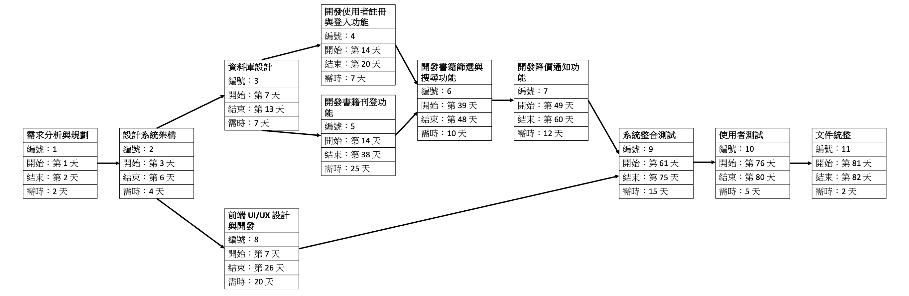

# 任務表格清單

| 任務編號 | 說明                     | 需時 (天) | 前置任務 | 備註                                 |
|----------|--------------------------|-----------|----------|--------------------------------------|
| 1        | 需求分析與規劃           | 2         | -        | 確認功能需求，制定專案規劃          |
| 2        | 設計系統架構             | 4         | 1        | 包含前端、後端架構設計              |
| 3        | 資料庫設計               | 7         | 2        | 設計書籍、用戶、交易資訊等資料表    |
| 4        | 開發使用者註冊與登入功能 | 7         | 3        | 基本會員系統，包含權限管理          |
| 5        | 開發書籍刊登功能         | 15        | 3        | 包含 OCR 功能、ISBN 碼辨識、自動填寫 |
| 6        | 開發書籍篩選與搜尋功能   | 10        | 4, 5     | 包括校區篩選、科系篩選、價位篩選等 |
| 7        | 開發降價通知功能         | 8         | 6        | 買家可訂閱書籍，接收降價提醒        |
| 8        | 前端 UI/UX 設計與開發    | 12        | 2        | 包含頁面設計、操作流程優化          |
| 9        | 系統整合測試             | 10        | 7, 8     | 確保功能整合正常運作                |
| 10       | 使用者測試               | 5         | 9        | 部署 App 並收集使用者回饋           |
| 11       | 文件統整                 | 2         | 10       | -                                    |

# PERT/CPM 圖

# 甘特圖

